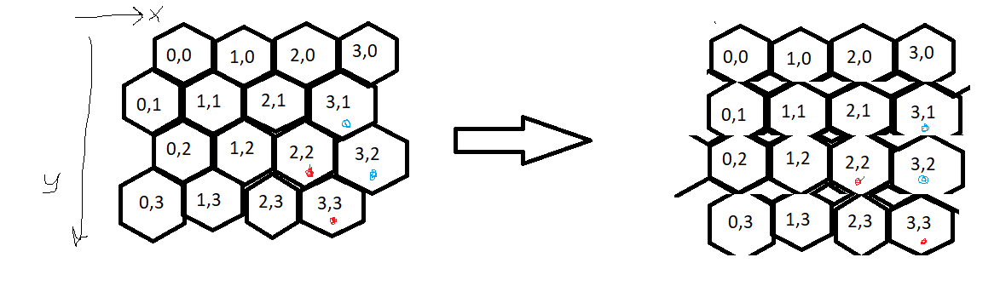

# SÜRÜ 2022
Sürü 2022 yarışması, Pekiştirmeli Öğrenme için geliştirilen strateji oyunu simülasyonunda, yarışmacıların eğittikleri yapay zekaların birbirleriyle ve referans botu ile çarpıştırılmasıyla gerçekleştirilecektir. Oyunun amacı, Oyunun sonu geldiğinde daha çok kaynağa sahip olan taraf olmaktır.

## Nasıl Kurulur?

Strateji oyunu simülasyonu Linux tabanlı bilgisayarlar için geliştirilmiştir ve diğer işletim sistemlerin çalışmamakta ya da düşük performans ile çalışmaktadır. Bu durumun bir sıkıntıya yol açmaması için ana dizindeki `dockerfile` dosyası yardımıyla bir Docker konteynırı oluşturmanızı ve dosyaları o şekilde kullanmanızı öneriyoruz. Eğer bahsedilen `dockerfile` dosyasını kullanmamayı tercih ediyorsanız bu dosyanın içinde bulunan Python, TensorFlow ve PyTorch kütüphanelerinin doğru versiyonlarının kurulduğundan emin olmanız gerekmektedir.

Daha sonrasında ana dizindeki `requirements.txt` dosyasında bulunan Python kütüphaneleri yüklenmelidir. Bütün bu gereksinimler yüklendiğinde kodlar kullanıma hazır hale gelmektedir.

## Nasıl Çalıştırılır?

### Çalıştırma Satırı

`python src/egitimkodu.py "harita" "mavi_takım" "kırmızı_takım"`

Yukarıdaki satır, terminal ekranı yardımıyla oyunun çalıştırılması için gereken argümanları ifade etmektedir. Burada `src/egitimkodu.py` src klasöründeki eğitim kodu dosyasını, `harita` data/config klasörü içindeki haritalardan hangisinin seçileceğini, `mavi_takım` ve `kırmızı_takım` ise karşılıklı çarpıştırılacak botları veya yapay zekaları temsil etmektedir. Örnek eğitim kodları; mavi takım eğitilen yapay zekayı, kırmızı takım ise rakibi temsil edecek şekilde oluşturulmuştur.

Örnek kullanım: `python src/agentsofglory.py ResourceRiver SimpleAgent RandomAgent`

`agentsofglory.py` yerine Stable-baselines3 eğitim örneği için `sb3cadet.py` veya RlLib-Ray eğitim örneği için `traincadet.py` dosyasını kullanabilirsiniz.

## Gym

### State

State (gözlem), yapay zekaların ortamdan gözlemledikleri parametreleri ifade eder.

State içindeki elemanlar:
`score = int, shape(2)`
`turn = int, shape(1)`
`max_turn = int, shape(1)`
`units = int, shape(y,x)`
`hps = int, shape(y,x)`
`bases = int, shape(y,x)`
`res = int, shape(y,x)`
`load = int, shape(y,x)`

state ayrıştırma örneği: 
`score = state['score']`
`turn = state['turn']`
`max_turn = state['max_turn']`
`units = state['units']`
`hps = state['hps']`
`bases = state['bases']`
`res = state['resources']`
`load = state['loads']`

### Action

Action (aksiyon), yapay zekaların ortamda uygulayacakları değişimi ifade eder.

Action kullanımı:
`[location, movement, target, recruitment]`

Location: (y,x) Tuple listesi

Movement: 0-6 aralığında doğal sayılar barındıran liste. 0 Action'ı durmayı, ateş etmeyi ve toplamayı (ünitenin türüne ve durumuna göre); 1-6 Action'ları ise altıgen ızgarada temsil edildiği şekilde hareket etmeyi simgeler.

Target: (y,x) Tuple listesi

Recruitment: 0-3 arası doğal sayı; 0 kamyon, 1 bir hafif tank, 2 ağır tank ve 3 ise İHA üretimini temsil eder.

Action'da Location elemanında ünitelerin koordinatları hangi sırayla verilmişse o sıra ile aksiyonlarını gerçekleştirilir. Verilen Movement ve Target listelerindeki aksiyonların sahibi olan ünite, Location listesinin sırası eşleşen elemanıdır (her listenin birinci elemanı gibi).   

## Oyun

### Grid World

Grid world Temsili: 

### Üniteler

Oyundaki üniteler:
- HeavyTank
- LightTank
- Truck
- Drone

Ünite kuralları `data/config/rules.yaml` dosyasından değiştirilebilmektedir. Ancak yarışmada bu dosyadaki kurallar kullanılacağından değiştirilmemesi önerilmektedir.

## Haritalar

Oyun haritaları `data/config` klasöründeki yaml dosyaları olarak tanımlanmıştır.

Kendi eğitim haritalarınızı oluşturmak için `demo.yaml` dosyasını örnek olarak kullanabilirsiniz. Kendi haritalarınızı oluşturarak yapay zekanızı tek haritaya bağlı kalmayacak şekilde eğitmeniz önerilmektedir.

ÖNEMLİ: Yarışma, (24x18) boyutlarına sahip haritalarda yapılacaktır. Bu boyutlara sahip harita örneği RiskyValley'dir (`data/config/RiskyValley.yaml`). Yarışmada kullanılacak haritalar gizli kalacaktır ve yapay zekanız bu boyutlardaki tüm haritalarda çalışabilir olmalıdır.  

ÖNEMLİ: Yarışma haritalarında yetki kapasitesi parametresi gereğince aynı turda en fazla 7 ünite kullanılabilecektir. Aksiyon boyutu buna uygun şekilde hazırlanmalıdır.

## Özneler

Örnek yapay zeka özneleri `src/agents` dosyasındadır. her öznenin kendisine ait dosya adı ve kendisine ait class adı bulunmalıdır. 

Özneler birer Gym ortamı olduğundan, içlerinde bulundurmaları gereken fonksiyonlar aşağıdaki gibidir:
- `__init__((self,team,action_lenght)`
- `reset(self)`
- `step(self, action)`
- `close(self,)`
- `render(self,)`

Bu fonksiyonların haricinde eğer isterseniz başka fonksiyonlar da ekleyebilirsiniz. Hatta işinize yarayacağını düşündüğünüz özellik hesaplamalarını veya makro aksiyonları `src/agents/utilities.py` dosyasında oluşturarak bunları Gym ortamınızda kullanabilirsiniz.

Beş örnek özne bulunmaktadır, bunlar:
-HumanAgent
-RandomAgent
-SimpleAgent
-GolKenari
-RiskyValley

Kendi öznenizi oluşturmak için `src/agents/BaseLearningGym.py` dosyasını şablon olarak kullanabilirsiniz.

### HumanAgent

HumanAgent yapay zeka veya bot yerine insanların API yardımıyla oyunu oynamasına olanak sağlar. Oyunda istenildiği takdirde istenilen yeri test etmek içindir.

### RandomAgent

RandomAgent tamamiyle rastgele aksiyonlar üreten bir bottur.

### SimpleAgent

SimpleAgent sadece `Truck` ve `LightTank` ünitelerini kullanır.  `Truck` ünitesi en yakındanki kaynakları toplayıp üsse götürmeye çalışır. `LightTank` ünitesi ise rakip ünitelere yaklaşır ve ateş eder. Rakip `Truck` üniteleri önce hedef alınır. SimpleAgent da yapay zeka kullanmayan bir bottur.

### GolKenari

GolKenari, boyutu (7x15) olan `data/config/golkenarivadisi.yaml` haritası için hazırlanmış bir yapay zeka eğitim kodudur.

### RiskyValley

RiskyValley, boyutu (24x18) olan `data/config/RiskyValley.yaml` haritası için hazırlanmış bir yapay zeka eğitim kodudur.

## Self-Play

Kendi eğittiğiniz yapay zeka öznesine karşı Self-Play ile yarışarak eğitim gerçekleştirebilirsiniz. `src/agents/SelfPlay.py` dosyasında rakip özne class'ını kendi eğittiğiniz özne yaparak ve eğittiğiniz öznenin modelini `checkpoint_path` parametresi ile göstererek Self-Play gerçekleştirebilirsiniz. Bu dosyadaki örnek RlLib-Ray eğitimi örneğidir. Self-Play sırasında bir müttefik özne öğrenmeye devam ederken rakip öznenin modeli sabittir. 

## Hangi Dosyalar Yüklenecek?
-Öznenin Class'ının bulunduğu kod (örneğin: `src/agents/RiskyValley.py`) yüklenmelidir. Dosya adı agent.py, dosyanın içinde EvaluationAgent Class'ı olmalıdır. EvaluationAgent Class'ının içinde eğitilmiş model yüklenmeli, oyundan gelen gözlemler (state) modele beslenmeli ve daha önce bahsedildiği şekilde oyunun istediği tipte aksiyonları "Act" metodu aracılığıyla vermelidir. `src/agents/RiskyValley.py` dosyası bir eğitim dosyası olduğu için bahsedilen Class boş bırakılmıştır. Kullandığınız veya kendi yazdığınız otomatik türevleme kütüphanesine uygun olacak şekilde bu dosyayı modifiye etmeniz gerekmektedir.

- `Utilities.py` dosyası değiştirildiyse de değiştirilmediyse de yüklenmelidir. Bu dosyada oyunda işe yarayabilecek hesaplamalar ve makro aksiyonlar bulunur ve agent.py dosyası tarafından kullanılır. Bu dosya `src/agents/utilities.py` dizininde bulunmaktadır.

-Eğitilmiş öznenin modeli yüklenmelidir. Kullandığınız otomatik türevleme kütüphanesine (TensorFlow, PyTorch...) göre dosya ismi değişecektir. "agent.py" dosyası içindeki "EvaluationAgent" Class'ı tarafından çağırılacaktır.  

-Eğer size verilen kütüphaneler dışında bir kütüphane yüklediyseniz, bu kütüphanelerin bulunduğu `requirements.txt` dosyası yüklenmelidir. Sizden yüklemenizi istediğimiz kütüphanelerin versiyonlarının doğru olması önemlidir ve yüklediğiniz kütüphaneler mevcut kütüphanelerin versiyonlarını değiştirmemelidir.

Bahsedilen dört dosya yüklendikten sonra varsa agent.py dosyası tarafından kullanılması gereken ekstra dosyaları da yükleyebilirsiniz. 

